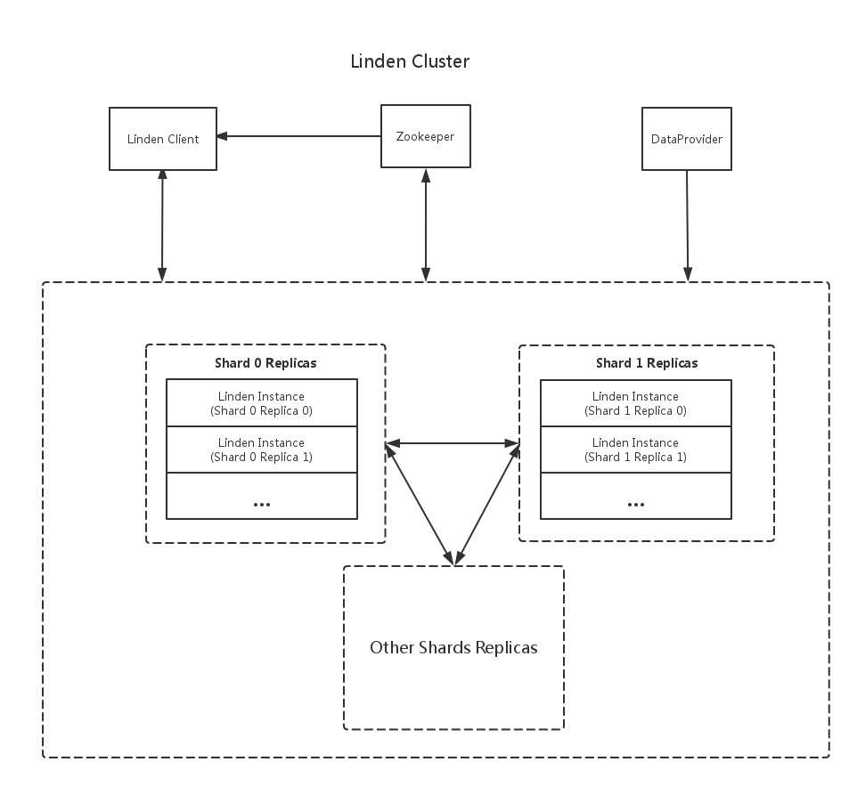
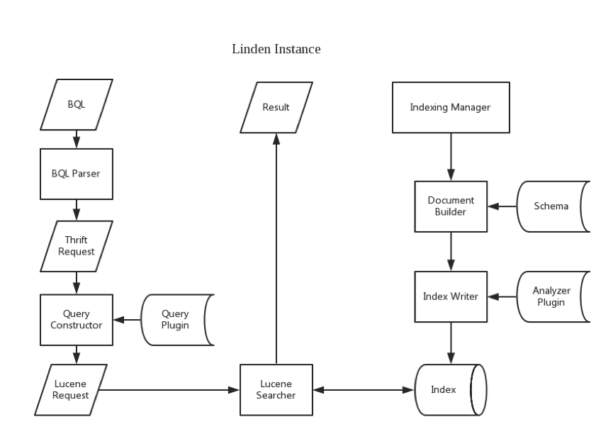

# Introduction
* Linden is a distributed and real-time search system built on top of Lucene
* Linden provides 2 type data injection ways, LindenClient (sync/push mode, see detail in [Linden Client](LindenClient.md)) and DataProvider (async/pull/stream mode, see detail in [Linden Plugin](LindenPlugin.md) Gateway section)
* Query language in linden is a SQL-like language named BQL  (see detail in [BQL](BQL.md))
* Linden provides a very simple way to tune search result rank named Relevance Model (see detail in [BQL](BQL.md))
* Linden also allow user to customize scoring logic from low index level (term, position, frequency) via a linden-customized query (see detail in [Linden Flexible Query document](LindenFlexibleQuery.md))
* Linden maintains N replicas of each shard index to guarantee availability and fault-tolerance
* Linden provides a relax consistency, eventual consistency between replicas is guaranteed by maintaining data stream order
* Code name linden is the name for the tree genus Tilia                                                                             

# Architecture

* Linden cluster topology is registered in zookeeper
* Linden client gets linden cluster topology from zookeeper and send index/search request to a random live linden instance
* Every linden instance consumes all data stream from DataProvider, and process the data in its responsibility range
* One linden instance only serves one shard index
* One shard index can have multiple replicas
* Each linden instance gets linden cluster topology from zookeeper
* Each linden instance works as both server node and broker
* Linden instance gets search request from client and sends search request to appropriate linden instances (may include itself) according to load balance strategy, merges result from those linden instances, and sends result to client
* All communication in linden cluster is based on twitter finagle

 
* BQL (Browse Query Language) is the only language between linden client and linden instance
* BQL is an SQL-like language, e.g. select * from linden by query is ‘content: hello’;
* BQL is parsed to an internal thrift request, which is the request between linden instances
* The thrift request is converted to lucene request by query constructor
* Query plugin allows user to customize query ranking logic
* Result is returned from lucene searcher in thrift
* Indexing manager consumes data from data stream producer
* Document builder builds lucene document from input document (in JSON format) according to linden schema
* Linden schema specifies how the index is build for every field
* Index writer allow user customize lucene analyzer by analyzer plugin
* Index writer write lucene document to index